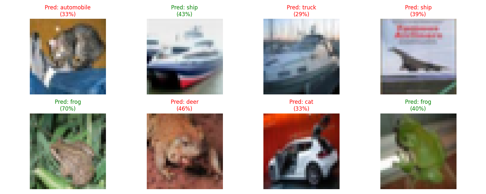

# Vision AI in 5 Days: Image Recognition Project

## Project Overview
This project implements an end-to-end image recognition system for the CIFAR-10 dataset using deep learning techniques. Over five days, we:
1. Built custom CNN architectures
2. Implemented data augmentation techniques
3. Applied transfer learning with MobileNetV2
4. Evaluated model performance with comprehensive metrics
5. Created portfolio-ready deliverables

## Key Results
| Model | Test Accuracy | Training Time |
|-------|---------------|---------------|
| Basic CNN | {:.2%} | ~20 min |
| Augmented CNN | {:.2%} | ~30 min |
| MobileNetV2 | {:.2%} | ~15 min |


*Sample predictions from our MobileNetV2 model*

## Setup and Installation

### 1. Google Colab (Recommended)
**Step-by-Step Guide:**
1. Open the project notebook: [](https://colab.research.google.com/github/your-username/Vision-AI-Project/blob/main/notebooks/Vision_AI_in_5_Days.ipynb)
2. Enable GPU acceleration:
   - Runtime → Change runtime type → GPU
3. Run the entire notebook:
   - Runtime → Run all
4. Access generated assets:
   - Models in `/models`
   - Visualizations in `/assets`

### 2. Local Machine via Jupyter
**Prerequisites:**
- Python 3.8+
- Virtual environment (recommended)

**Installation:**
```bash
# Create virtual environment
python -m venv vision-ai-env
source vision-ai-env/bin/activate  # Linux/Mac
vision-ai-env\Scripts\activate    # Windows

# Install dependencies
pip install -r requirements.txt

# Additional dependency for Jupyter
pip install notebook

# Launch Jupyter notebook
jupyter notebook

# Open and run:
notebooks/Vision_AI_in_5_Days.ipynb


# File structure
Vision-AI-Project/
├── notebooks/               # Main implementation notebook
├── models/                  # Trained models (.keras format)
│   ├── basic_cnn_cifar10.keras
│   ├── augmented_cnn_cifar10.keras
│   └── mobilenetv2_cifar10.keras
├── assets/                  # Visualizations
│   ├── training_history.png
│   ├── confusion_matrix.png
│   ├── model_comparison.png
│   └── sample_predictions.png
├── scripts/                 # Reusable modules
│   ├── data_loader.py
│   ├── model_builder.py
│   ├── transfer_learning.py
│   └── evaluator.py
├── results/                 # Sample predictions
│   └── sample_predictions.csv
├── requirements.txt         # Dependencies
└── README.md                # Project documentation
